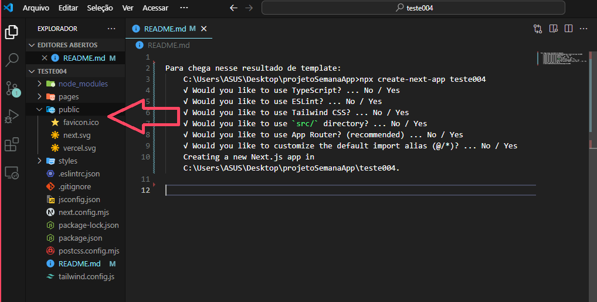

 # Para chega nesse resultado de template: 
    C:\Users\ASUS\Desktop\projetoSemanaApp>npx create-next-app teste004
    √ Would you like to use TypeScript? ... No / Yes
    √ Would you like to use ESLint? ... No / Yes
    √ Would you like to use Tailwind CSS? ... No / Yes
    √ Would you like to use `src/` directory? ... No / Yes
    √ Would you like to use App Router? (recommended) ... No / Yes
    √ Would you like to customize the default import alias (@/*)? ... No / Yes
    Creating a new Next.js app in C:\Users\ASUS\Desktop\projetoSemanaApp\teste004.

## Devo criar os componetes fora da pasta "pages" para garantir que esses elemento nao vao se exibidos de formas independentes

## sempre que for chama um style {} primeiro par de chaves acerssa o js e o segundo um obj      
    

        
